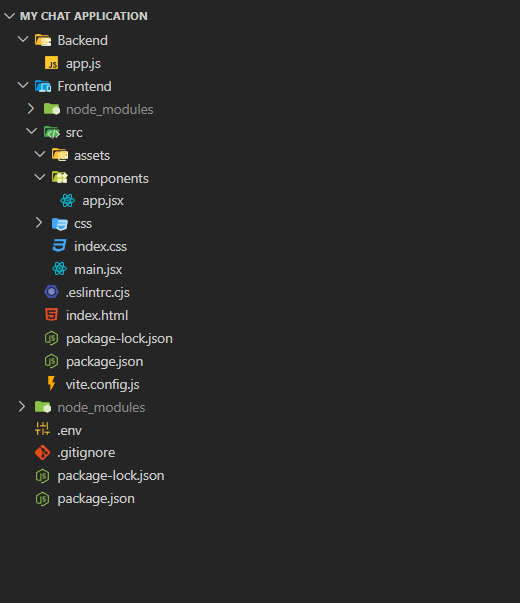

# Configuring .env: 

- Just add .env file in your project's root directory for defining the environment variables in it. 
- Define variables like PORT = 8000 in your .env file 
- And in your backend's app.js file, just require dotenv package that we have installed from npm and then call dotenv.config() function if you want to use the environment variables which you are defining in the .env file 


<span style="color: lightgreen"> @ My Sample Code: </span>


## For root directory's .env file: 

```

PORT = 8000

```


## For Backend/app.js

```

const express = require('express'); 
const dotenv = require('dotenv'); 

dotenv.config(); 

const app = express(); 
const PORT = process.env.PORT || 5000; 


app.get('/test', (req, res) => {

    res.send(`<h1> I am working totally fine </h1>`)

});


app.listen(PORT, (err) => {
    if(err){
        console.log(err); 
    } 
    else{
        console.log('Server started successfully.'); 
        console.log(`Listening on port ${PORT}`); 
        console.log(`Press ctrl and click me: http://localhost:${PORT}`); 
    }
})

```


# My Chat Application's Final Directory Structure Set-Up: 

